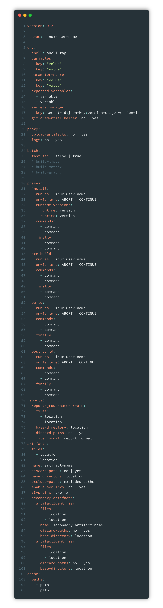
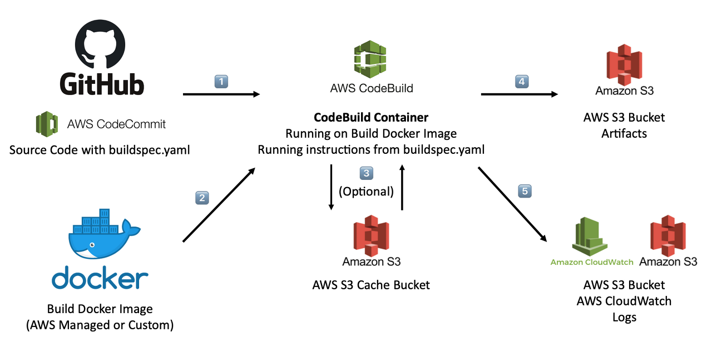

# AWS S3, AWS CloudFront, AWS CodeBuild

### AWS S3?

* AWS S3는 AWS Simple Storage Service로 인터넷용 스토리지 서비스임. 이 서비스는 개발자가 더 쉽게 웹 규모 컴퓨팅 작업을 수행 할 수 있도록 설계됨

### AWS S3 특징

* 제공하는 단순한 웹 서비스 인터페이스를 사용하여 웹에서 언제 어디서나 원하는 양의 데이터를 저장하고 검색할 수 있음
* 개발자는 Amazon이 자체 웹 사이트의 글로벌 네트워크 운영에 사용하는 것과 같은 높은 확장성과 신뢰성을 갖춘 빠르고 경제적인 데이터 스토리지 인프라에 엑세스할 수 있음
* 단독 스토리지로도 사용할 수 있으며 EC2, EBS, Glacier와 같은 다른 AWS 서비스와도 함께 사용할 수 있어 클라우드 어플리케이션, 컨텐츠 배포, 백업 및 아카이빙, 재해 복구 및 빅데이터 분석을 포함한 다양한 사례에 알맞음
* S3의 버킷은 무한대의 객체를 저장할 수 있으므로 스토리지의 요구를 미리 추정하여 관리할 필요가 없어 확장 / 축소에 신경쓰지 않아도 됨
* HTTPS 프로토콜을 사용하여 SSL로 암호화된 엔드포인트를 통해 데이터를 안전하게 업로드 / 다운로드 할 수 있으며 상주 데이터를 자동으로 암호화하고 AWS KMS를 통해 S3에서 사용자를 위해 키를 관리하게 하는 방법과 고유한 키를 제공하는 방법 중에서 키 관리 방법을 선택할 수 있는 기능을 제공함
* 사용한 스토리지 만큼 요금이 청구되며 데이터 전송부분에서는 해당 리전 내에서는 데이터 송수신은 무료 (다른 AWS 리전으로는 무료가 아님)이고 S3에서 인터넷으로 데이터를 송수신 시에도 가격이 매우 저렴함

### AWS S3 목적

* 규모의 이점을 극대화 하고 개발자들에게 이러한 이점을 제공하는 것

### AWS S3 기본 개념

* 객체(Object): S3에 데이터가 저장되는 기본 단위로써 파일과 메타데이터로 이루어져 있음. 객체 하나의 크기는 1Byte 부터 5TB까지 허용되며 메타데이터는 MIME 형식으로 파일 확장자를 통해 자동으로 설정되며 사용자 임의로 지정 가능함
* 버킷(Bucket): S3에서 생성할 수 있는 최상위 디렉토리의 개념으로 이름은 S3 리전 중에서 유일해야 함. 계정별로 100개까지 생성 가능하며 버킷에 저장할 수 있는 객체수와 용량은 무제한임
* 표준 스토리지: S3 서비스 수준 계약으로 객체에 대해 99.99999999%의 내구성을 보장하며 99.99%의 가용성을 제공함. 하지만 높은 내구성을 보장해야 하는 만큼 비용이 높으므로 유실되면 안되는 원본 데이터, 민감 정보, 개인정보 등의 중요한 데이터를 저장하는 것이 알맞음
* RRS(Reduced Redundancy Storage): 표준 스토리지보다 저렴한 비용으로 데이터를 저장할 수 있음. RRS 옵션은 여러 시설 전반에 다양한 디바이스에 객체를 저장하며 일반 디스크 드라이브의 400배에 달하는 내구성을 제공하나 표준 스토리지 만큼 많이 객체를 복제하지는 않으므로 원본을 복제한 데이터나 가공한 데이터의 저장에 알맞음

### AWS CloudFront?

* .html, .css, .js 및 이미지 파일과 같은 정적 및 동적 웹 콘텐츠를 사용자에게 더 빨리 배포하도록 지원하는 웹 서비스임
* aws cloudfront는 cdn의 일종임
  * cdn은 content delivery network or content distribution network로 콘텐츠를 효율적으로 전달하기 위해 여러 노드를 가진 네트워크에 데이터를 저장하여 제공하는 시스템을 말함
  * 인터넷 서비스 제공자 (ISP, Internet Service Provider)에 직접 연결되어 데이터를 전송하므로, 콘텐츠 병목을 피할 수 있는 장점이 있음

### AWS CloudFront 특징

* 엣지 로케이션이라고 하는 데이터 센터의 전 세계 네트워크를 통해 콘텐츠를 제공함
* CloudFront를 통해 서비스하는 콘텐츠를 사용자가 요청하면 지연 시간이 가장 낮은 엣지 로케이션으로 라우팅되므로 콘텐츠 전송 성능이 뛰어남
* 콘텐츠가 이미 지연 시간이 가장 낮은 엣지 로케이션에 있는 경우 CloudFront가 콘텐츠를 즉시 제공함
* 콘텐츠가 엣지 로케이션에 없는 경우 CloudFront는 콘텐츠의 최종 버전에 대한 소스로 지정된 오리진 (Amazon S3 버킷, MediaPackage 채널, HTTP 서버 (웹 서버와 같은) 에서 콘텐츠를 검색함
* AWS 백본 네트워크를 통해 콘텐츠를 가장 효과적으로 서비스할 수 있는 엣지로 각 사용자 요청을 라우팅하여 콘텐츠 배포 속도를 높임. 일반적으로 CloudFront 엣지가 최종 사용자에게 가장 빨리 제공함
* AWS 네트워크를 사용하면 사용자의 요청이 반드시 통과해야 하는 네트워크의 수가 줄어들어 성능이 향상됨. 파일의 첫 바이트를 로드하는 데 걸리는 지연 시간이 줄어들고 데이터 전송 속도가 빨라짐
* 파일 (객체)의 사본이 전 세계 여러 엣지 로케이션에 유지 (또는 캐시) 되므로 안정성과 가용성이 향상됨

### AWS CloudFront 예시

* 예를 들어 CloudFront가 아닌 일반적인 웹 서버에서 이미지를 제공한다고 가정하면 https://hmkim.amazon.com/example.png url을 사용하여 example.png라는 이미지를 서비스 할 수 있음
* 사용자는 이 url로 쉽게 이동해 해당 이미지를 볼 수 있음. 하지만 이미지가 발견될 때 까지 인터넷으로 이루어진 상호 연결된 네트워크의 복잡한 모음을 통해 네트워크에서 다른 네트워크로 요청이 라우팅되었다는 사실은 모르고 있을 것임

### AWS CodeBuild?

* AWS CodeBuild는 소스 코드 컴파일부터 테스트, 빌드, 패키징 기능을 제공하는 서비스임. AWS의 완전 관리형 서비스이기 때문에 직접 빌드 서버를 구축하고 관리할 필요가 없음
* CodeBuild는 빌드하는 어플리케이션의 용량에 따라 자동으로 확장하거나 축소함. 또한 여러개의 빌드를 동시에 실행할 수 있기 때문에 대기열에서 대기하지 않고 바로 처리됨. 또한 빌드 프로젝트를 생성하는 것만으로 요금이 나가지 않고 해당 빌드 프로젝트를 시작하고 완료할 때 까지 걸리는 시간을 기준으로 비용이 청구되기 때문에 유연함
* 소스코드는 Github, AWS CodeCommit, CodePipeline, S3등 다양한 곳에서 가져올 수 있음. 빌드 결과 기록은 S3나 CloudWatch Logs에 저장할 수 있으며 해당 기록을 보고 결과를 분석할 수 있음
* 또한 빌드 결과에 대한 metrics 지표도 CloudWatch에서 확인할 수 있음. 지표로부터 도출해낸 결과를 바탕으로 CloudWatch의 Alarm (notification)을 설정하면 빌드 설정의 문제점 혹은 과정에서의 문제를 바로 알 수 있음.
* 그리고 CloudWatch의 Event를 통해 빌드를 주기적으로 실행하도록 설정할 수 있음. 코드의 변화가 많은 어플리케이션은 실시간으로 테스트를 하는 것이 중요한데 event rule을 설정하면 원하는 시간마다 빌드를 반복 수행하도록 설정할 수 있음.
* 그외에도 AWS Lambda를 이용하여 직접 CI / CD 환경을 구축할 수도 있음.

### buildspec.yaml 파일 구조

* CodeBuild는 buildspec.yaml이라는 파일에 의해 동작함. buildspec.yaml은 코드의 root 경로에 위치해야 하며 다른 이름으로 저장해도 되나 기본은 buildspec.yaml이라는 이름으로 정해져 있기 때문에 보통 이 이름을 사용함. 아래는 buildspec.yaml 파일의 구조 예

* 가장 주목해야 할 부분은 phases임. phases에 정의된 4단계는 각각 해당 단계에서 실행하는 명령어들 및 설정들을 수행함
* install: 소스의 런타임을 포함한 dependency를 설치함. 예를 들어 node.js 기반의 어플리케이션은 node.js 런타임을 설치해주어야 함. 그리고 실제 빌드 (테스트) 전에 실행해야 할 명령어 혹은 설정해야 할 부분을 입력함
* pre\_build: 빌드를 실행하기 직전에 최종으로 실행해야 할 명령어를 정의함
* build: 실제 빌드 혹은 테스트를 하는 동작을 정의함. 여기서 'build에 모두 다 설정하면 되지 굳이 prebuild룰 추가야하나?'라는 의문이 들 수있음. build에서는 실제로 동작하는 명령어를 정의하기 때문에 큰 어플리케이션의 경우 많은 시간이 소요될 수 있음. 만일 그 뒤에 실행시간이 아주 짧은 명령어를 실행한다고 하면 빌드 실제 동작은 성공적으로 마쳤는데 뒤에 있는 아주 작은 명령어 때문에 앞에서 한 빌드가 무용지물이 될 수 있음. 따라서 실제 빌드와 큰 의존성이 없고 실행시간이 짧은 명령어들은 앞의 단계에 넣어 이러한 사고를 방지하기 위해 p_re_\_build가 필요함
* post\_build: 빌드가 끝나고 마무리하는 명령어들을 정의함. 예를 들어 결과물들을 zip으로 압축하는 과정이 있을 수 있음
* 그리고 artifacts는 작업의 결과물을 말하는데 CodeBuild는 도커 기반의 컨테이너로 동작하고 빌드 과정이 끝나면 해당 컨테이너는 사라짐. 즉 파일로 남는 작업의 결과물이 없음. artifacts를 설정하면 설정한 작업의 결과물을 s3로 업로드 할 수 있음. 참고로 s3에서 암호화를 설정하면 해당 파일이 함호화되어 업로드됨

### CodeBuild 동작 과정

* 아래 그림은 CodeBuild가 동작하는 과정을 나타낸 그림

* 빌드를 하는 소스를 설정함.
* 도커 기반의 컨테이너를 생성하기 위한 이미지를 설정함
* (optional) 여러 빌드를 동시에 수행할 때 성능 향상을 위해 cache bucket을 사용할 수 있음
* 빌드의 결과인 artifacts를 생성하여 s3 bucket에 저장함
* 빌드의 로그를 s3 bucket이나 cloudwatch를 통해 확인 할 수 있&#x20;
