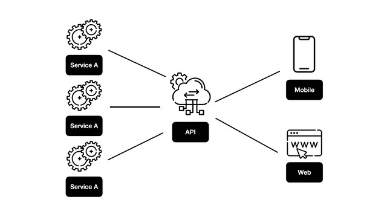
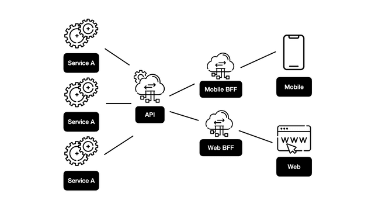

# BFF(Back-end For Front-end)

최근 Back-End에서 MSA(Micro Service Architecture)를 많이 사용하게 됨.

* 여러 플랫폼을 지원하게 되면서 각각 특정 데이터가 필요한 상황
* 원하는 데이터 형태에 도달하기 위해 여러 API 호출의 응답을 조작, 혼합, 일치 시키는 상황
* 이런 상황들이 겹쳐 프론트엔드에서 복잡한 계산이나 비즈니스 로직을 작성하는 상황

위와 같은 상황을 종종 경험하게 됨.

소스코드가 복잡해짐에 따라 정리가 어려워지고 렌더링이 느려지는 경우가 발생할 수 있음. UI 스레드에서 렌더링과 비즈니스 로직 수행이 경합을 벌이기 때문

이를 개선하기 위해 BFF를 사용하게 됨

<figure><figcaption>
일반적 API 구조
</figcaption></figure>

<figure><figcaption>
BFF 구조
</figcaption></figure>

다양한 플랫폼을 지원하는 API는 때로 사용하지 않는 불필요한 데이터가 포함될 수 있음

위 첫번째 그림 처럼 여러 플랫폼이 있을 경우, FE에서는 동일한 API를 호출하게 됨. BE 개발자는 여러 플랫폼의 모든 요구사항들을 충족시키기 위해 모든 데이터를 내려주도록 API를 구현하게 됨. 이외에도 BE에서 데이터를 처리하기 위해 필요했던 부가적인 것들을 내려주거나, 단일 페이지에서 여러 API를 호출하는 경우도 발생.

이처럼 직접 API에 의존할 때 여러가지 이슈가 발생할 수 있음

* MSA 환경에서 API 엔드포인트가 분리될 때 팔로업 이슈
* CORS 이슈
* API 입장에서 여러 플랫폼과 스펙을 맞출 때의 커뮤니케이션 비용
* 플랫폼별로 다를 수 밖에 없는 인증 방식을 통합하려는 무리한 시도
* 화면에 필요한 데이터만 받는 PARTIAL RESONSE를 하기 어려운 이슈

이처럼 API를 다이렉트로 의존할 때의 이슈를 해결하고자 BFF가 등장함. Backend For Frontend라는 뜻 처럼 FE를 위한 중간 서버를 구현하는 것

위 두번째 그림 처럼 하나의 FE에 대해 하나의 BFF가 있어야 하며 BFF를 FE의 요구사항에 맞게 구현할 수 있음. 그렇기에 여러 플랫폼을 지원하지 않을 경우에는 BFF가 의미 없을 수 있음.

BFF에서는 FE 생산성을 더욱 높이기 위해 데이터를 통합하는 처리를 담당함. 또한, BFF를 구현하여 FE를 BE에서 분리된 상태로 유지할 수 있음. BFF는 FE 요구사항을 충족하기 위해 존재하며, 이상적으로는 FE 개발자가 빌드해야 함.

결론적으로, 위에서 언급한 API 의존성 이슈들을 BFF쪽에서 처리 할 수 있음.

