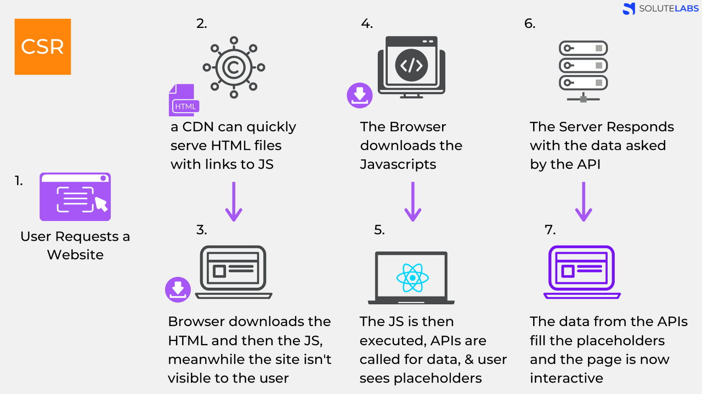
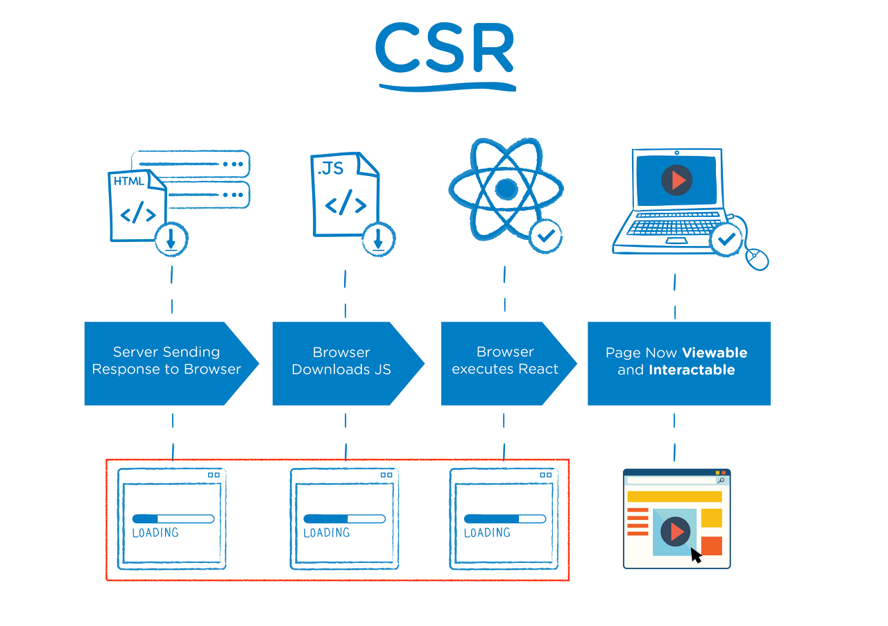
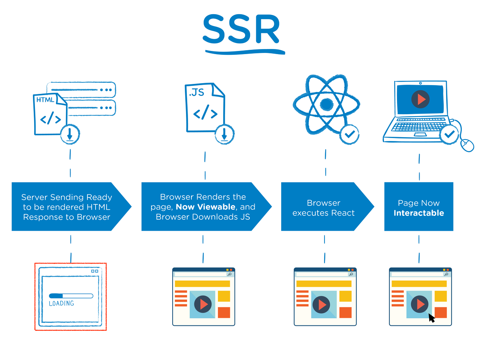

# CSR vs SSR

### CSR ( Client Side Rendering)

* Rendering이 클라이언트 측에서 일어남
* 서버는 요청을 받으면 클라이언트에 HTML과 JS를 보내주고 클라이언트는 그것을 받아 Rendering을 시작함
* 사용자의 브라우저에서 js를 실행하여 렌더링을 하게 되므로 초기 렌더링 시 약간의 로딩 과정이 필요함

<figure><figcaption></figcaption></figure>

1. User가 website 요청을 보냄
2. CDN이 HTML 파일과 JS로 접근할 수 있는 링크를 클라이언트로 보냄
3. 클라이언트는 HTML과 JS를 다운 받음 (이때 User는 아무것도 볼 수 없음)
4. 다운이 완료된 js가 실행됨. 데이터를 위한 api가 호출됨 (이때 유저들은 placeholder를 보게 됨)
5. 서버가 api 요청에 응답함
6. Api로부터 받아온 data를 placeholder 자리에 넣어줌. 페이지는 상호작용이 가능해지게 됨

<figure><figcaption></figcaption></figure>

### SSR (Server Side Rendering)

* Rendering이 서버 쪽에서 일어나 클라이언트에 전달하는 방식

<figure><figcaption></figcaption></figure>

1. User가 website로 요청을 보냄
2. Server는 'Ready to Render', 즉, 즉시 Rendering 가능한 html 파일을 만듦 (리소스 체크, 컴파일 후 완성된 html 컨텐츠로 만듦)
3. 클라이언트에 전달되는 순간, 이미 Rendering 준비가 되어있기 때문에 바로 Rendering 되지만 조작은 불가함 (js가 읽히기 전이므로)
4. 클라이언트가 js를 다운 받음
5. 다운 받아지고 있는 사이 user는 컨텐츠는 볼 수 있지만 사이트를 조작 할 수는 없음. 이때 사용자의 조작을 기억하고 있음
6. 브라우저가 js 프레임워크를 실행함
7. js까지 성공적으로 컴파일 되었기 때문에 기억하고 있던 사용자 조작이 실행되고 웹페이지는 상호작용 가능해짐

<figure><figcaption></figcaption></figure>

* 서버에서 rendering 가능한 상태로 전달되기 때문에 js가 다운로드 되는 동안 사용자는 ui를 보고 있을 수 있음

### CSR vs SSR

* 웹페이지를 로딩하는 시간
  * 웹페이지 로딩의 종류는 두가지로 나눌 수 있음. 하나는 웹 사이트의 가장 첫 페이지를 로딩하는 것이며 다른 하나는 나머지를 로딩 하는 것
  * CSR의 경우 html, css와 모든 스크립트들을 한번에 불러옴. 반면 SSR은 필요한 부분의 html과 스크립트만 불러오게 됨. 따라서 평균적으로 SSR이 더 빠름
  * 나머지 로딩 시간
  * 첫페이지를 로딩한 후 다른 곳으로 이동하는 식의 동작을 가정 할 때 CSR은 이미 첫 페이지를 로딩할 때 나머지 부분을 구성하는 코드를 받아왔기 때문에 빠름. 반면 SSR은 첫 페이지를 로딩한 과정을 다시 실행함. 그래서 더 느리게 됨
* SEO (Search Engine Optimization) 대응
  * 검색 엔진은 자동화된 로봇은 '크롤러'로 웹 사이트들을 읽음. CSR은 js를 실행시켜 동적으로 컨텐츠가 생성되기 때문에 js가 실행 되어야 metadata가 바뀜. (이전 크롤러들은 js를 실행 시키지 않았었기에 SEO 최적화가 필수였음. 구글이 트렌드를 바꾸고 있다고 함)
  * SSR은 애초에 서버 사이드에서 컴파일 되어 클라이언트로 넘어오기 때문에 크롤러에 대응하기 용이함
* 서버 자원 사용
  * SSR이 서버 자원을 더 많이 사용함. 매번 서버에 요청을 하기 때문
  * 리액트로 구현할 때는 다음과 같은 문제가 생기기도 함
    * renderToString은 리액트에서 SSR을 구현하는데 사용되는 메소드임. 이게 스택을 막고 동기적으로 처리됨. 이게 실행될 동안 서버는 멈추게 됨. 참고로 renderToString은 리액트가 버전업이 되면서 '클라이언트에서'의 퍼포먼스가 개선됨
    * CSR은 당연하게도 클라이언트에서 동작을 주로 하므로 서버에 부하가 적음

