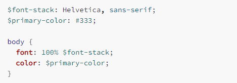
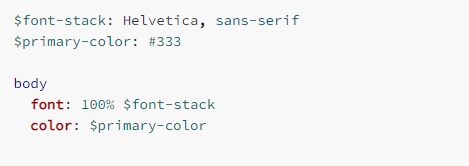

# CSS, SCSS, SASS

### 기본 개요

* SASS와 SCSS는 CSS를 편리하게 사용 할 수 있도록 하며 추가 기능이 있는 확장판 스크립트 언어임
* SASS, SCSS에서 기존의 CSS의 기능 부재 단점을 보완한 다양한 기능 추가함
* SASS는 들여쓰기 + 줄 바꿈 형식, SCSS는 중괄호 + 세미콜론 형식으로 구성됨
* 전 세계적으로 봤을 때 SCSS 사용자 수, SCSS를 활용한 library & framework 수가 SASS보다 더 많음
* SASS보다 SCSS가 CSS와의 호환성이 더 좋음





### SCSS? SASS?

* CSS: Cascading Style Sheets로 종속형 시트
* SASS: Syntactically Awesome Style Sheets로 문법적으로 awsome한 스타일 시트
* SCSS: Sassy CSS로 문법적으로 Sassy한 CSS
* SCSS가 SASS보다 더 뒤에 나왔고 (SASS3 버전에서 SCSS가 생김) 약간의 문법 차이가 있지만 SCSS가 좀 더 넓은 범용성과 CSS의 호환성의 장점을 가짐. 큰 차이점은 SASS는 중첩으로 들여쓰기를 사용하고 속성 구분은 줄 바꿈을 이용하지만 SCSS의 경우 중괄호로 중첩을 표현하고 세미콜론으로 속성을 구분함
* 또한 공식 레퍼런스는 SASS보다 CSS와 더 비슷한 SCSS를 선호한다고 함. 또한 다수의 libarary, framework가 SCSS 문법을 활용하며 사용자 수 또한 SASS보다 SCSS가 더 많음&#x20;

### 이들을 사용하는 이유

* CSS가 복잡한 언어는 아니지만 프로젝트의 크기가 커지고 고도화 될 수록 유지보수에 큰 어려움이 생김.&#x20;
* 기존의 CSS는 불필요한 선택자 (Selector), 연산 기능 한계, 구문 (Statement)의 부재의 문제점이 있고 SASS와 SCSS는 이러한 이슈를 해소 시켜 줄 수 있음&#x20;
* 통상적으로 SASS보다 SCSS를 많이 사용하는데 SCSS의 경우 CSS 문법과 완벽하게 호환이 되는 장점이 있음. 또한 코드의 가독성과 재사용성을 높여주며 심플한 표기법으로 CSS 구조를 평준화 할 수 있음

### 제공하는 기능 / 예시

* 변수 (Variable) 할당
* 중첩 (Nesting) 구문
* 모듈화 (Modularity)
* 믹스인 (Mixins)
* 확장 & 상속 (Extend / Inheritance)
* 연산자 (Operators)

#### 변수 (Variable) 할당

```css
/* CSS */
body {
    font: 100% Helvetica, snas-serif;
    color: #333;
}
```

```scss
/* SCSS */
$font-stack: Helvetica, sans-serif;
$primary-color: #333;

body {
    font: 100% $font-stack;
    color: $primary-color;
}
```

#### 중첩 (Nesting) 구문

```css
/* CSS */
nav ul {
    margin: 0;
    padding: 0;
    list-style: none;
}
nav li {
    display: inline-block;
}
nav a {
    display: block;
    padding: 6px 12px;
    text-decoration: none;}
```

```scss
/* SCSS */
nav {
    ul {
        margin: 0;
        padding: 0;
        list-style: none;
    }
    
    li { display: inline-block;}
    
    a {
        display: block;
        padding: 6px 12px;
        text-decoration: none;
    }
}
```

#### 모듈화 (Modularity)

```css
/* CSS */
body {
    font: 100% Helvetica, sans-serif;
    color: #333;
}

.inverse {
    background-color: #333;
    color: white;
}
```

```scss
/* _base.scss */
$font-stack: Helvetica, sans-serif;
$primary-color: #333;

body {
    font: 100% $font-stack;
    color: $primary-color;
}
```

```scss
/* style.scss */
@use 'base';

.inverse {
    background-color: base.$primary-color;
    color: white;
}
```

#### 믹스인 (Mixins)

```css
/* CSS */
.info {
    background: Dar4kGray;
    box-shadow: 0 0 1px rgba(169, 169, 169, 0.25);
    color: #fff;
}

.alert {
    background: DarkRed;
    box-shadow: 0 0 1px rgba(139, 0, 0, 0.25);
    color: #fff;
}

.success {
    background: DarkGreen;
    box-shadow: 0 0 1px rgba(0, 100, 0, 0.25);
    color: #fff;
}
```

```scss
/* SCSS */
@mixin theme($theme: DarkGray) {
    background: $theme;
    box-shadow: 0 0 1px rgba($theme, .25);
    color: #fff;
}

.info {
    @include theme;
}
.alert {
    @include theme($theme: DarkRed);
}
.success {
    @include theme($theme: DarkGreen);
}
```

#### 확장 & 상속 (Extend / Inheritance)

```css
/* CSS */
/* This CSS will print because %message-shared is extended. */
.message, .success, .error, .warning {
    border: 1px solid #ccc;
    padding: 10px;
    color: #333;
}

.success {
    border-color: green;
}

.error {
    border-color: red;
}

.warning {
    border-color: yellow;
}
```

```scss
/* SCSS */
/* This CSS will print because %message-shared is extended. */
%message-shared {
    border: 1px solid #ccc'
    padding: 10px;
    color: #333;
}

/* This CSS won't print because %equal-heights is never extended. */
%equal-heights {
    display: flex;
    flex-wrap: wrap;
}

.message-heights {
    @extend %message-shared;
}

.success {
    @extend %message-shared;
    border-color: green;
}

.error {
    @extend $message-shared;
    border-color: red;
}

.warning {
    @extend $message-shared;
    border-color: yellow;
}
```

#### 연산자 (Operators)

```css
/* CSS */
.container {
    display: flex;
}

article[role="main"] {
    width: 62.5%;
}

aside[role="complementary"] {
    width: 31.25%;
    margin-left: auto;
}
```

```scss
/* SCSS */
@use "sass:math";

.container {
    display: flex;
}

article[role="main"] {
    width: math.div(600px, 960px) * 100%;
}

aside[role="complementary"] {
    width: math.div(300px, 960px) * 100%;
    margin-left: auto;
}
```

* math.div 외에도 sin, cos, random, max 등 여러가지 수학적 기능 사용할 수 있음

### SASS, SCSS가 적용되는 원리

* SASS, SCSS를 CSS pre-processor (전처리기) 라고도 하는데 스크립팅 언어이기 때문에 SASS, SCSS로 작성된 파일들은 곧바로 웹에 적용될 수는 없음. 웹은 기본적으로 CSS 파일로 동작하므로 별도의 컴파일 과정을 거친 다음 CSS파일로 변환하여 사용하게 됨

### SASS, SCSS의 단점

* 전처리기를 위한 도구가 필요함
* 컴파일 시간이 소요됨


\#출처 : [https://cocoon1787.tistory.com/843](https://cocoon1787.tistory.com/843)
