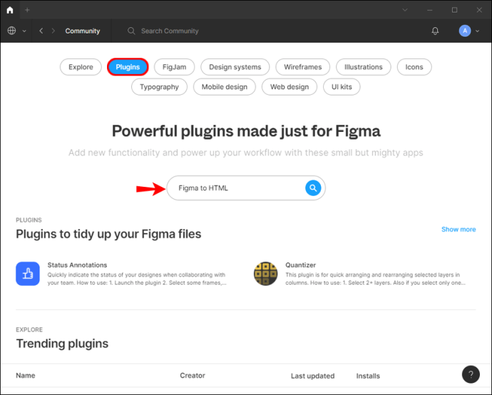

# Figma 결과물을 적용하는 방법

### Figma?

* 웹 기반의 UI / UX 디자인 및 프로토타이핑 툴
* 개인으로 사용하면 사실상 무료이며 이외에는 부분 유 프로그램임
* 무료 프로그램임에도불구하고 다른 디자인 툴인 어도비 XD, 스케치 등에 비해 뒤쳐지지 않고 오히려 더 나은 성능을 보여주며 유저들의 선호도가 높아지고 있음
* 웹 기반이기에 따로 설치가 필요하지 않지만, 필요에 따라 DESKTOP APP 도 제공

### 적용 방법

#### for Windows

* Figma inspect
  * Figma에 내장 되어 있으므로 플러그인이나 타 앱을 설치할 필요 없음
* Figma Plugin
  * Figma는 수백 가지의 플러그인을 제공함.&#x20;
  * Figma to HTML
    * 해당 플러그인 설치 후 아래의 단계를 거치게 됨

* 디자인으로 들어가 원하는 요소 선택

* Anima for Figma
  * 해당 플러그인을 사용하면 디자인을 HTML, CSS, REACT 및 VUE로 변환 가능
  * 해당 플러그인을 사용하기 위해 아래의 단계를 거침

* Export할 요소 선택

* 코드 유형을 선택 후 코드 내보내기 선택

#### for Mac

* Figma Inspect
  * Figma Inspect를 사용하면 Android, iOS 또는 웹(css만 해당)의 세 가지 코드 옵션 중에서 선택할 수 있음
  * Mac에서 Figma Inspect를 사용하려면 아래의 단계를 거침
    * Export할 요소 선택
    * 오른쪽의 검사 탭 클릭
    * CSS, iOS 또는 Android 중에 선택
    * 코드 복사 수행
  * CSS, iOS, Android 에만 관심이 있다면 이 도구를 사용하는 것이 좋으나 디자인을 HTML로 내보내려면 다른 방법을 사용해야 함
* Figma Plugin
  * Figma가 제공하는 여러 Plugin 중 가장 인기있는 방법들 소개함
  * Figma to HTML
    * 해당 Plugin은 디자인을 CSS or HTML로 변환할 수 있음
    * 아래의 설치 단계를 거침

* 디자인으로 돌아가 export할 요소 선택

* Figma to Code
  * 해당 Plugin으로 디자인을 HTML, Tailwind, Flutter 또는 Swift UI로 변환 할 수 있음
  * 아래의 단계에 따라 설치 후 사용

* 디자인으로 이동하여 원하는 요소 선택

* 원하는 코드 선택
* 클립보드에 복사 선택

### 기타 기기에서 사용

#### iPhone

* Figma mirror앱을 사용하면 모든 ios기기에 디자인 미러링 가능하여 변경 사항 추적 가능
* Figma iPhone앱은 현재 베타 버전만 제공 되며 컴퓨터에서 디자인을 편집하는 동안 iPhone에서 디자인을 탐색 및 액세스하고 실시간 변경 사항 추적 가능
* 직접적인 편집은 불가능하고 변경 사항 추적만 가능한 상황

#### iPad

* iPad에서 Figma 코드를 내보낼 수 없음
* Figma Mirror 앱은 iPad 에서 사용 가능, 이 앱을 통해 변경 사항 추적 가능

#### Android

* Andoriod에서 코드를 내보낼 수 없으나 Figma Mirror 앱을 통해 변경 사항 추적 가능
* 코드 내보내기는 불가능

