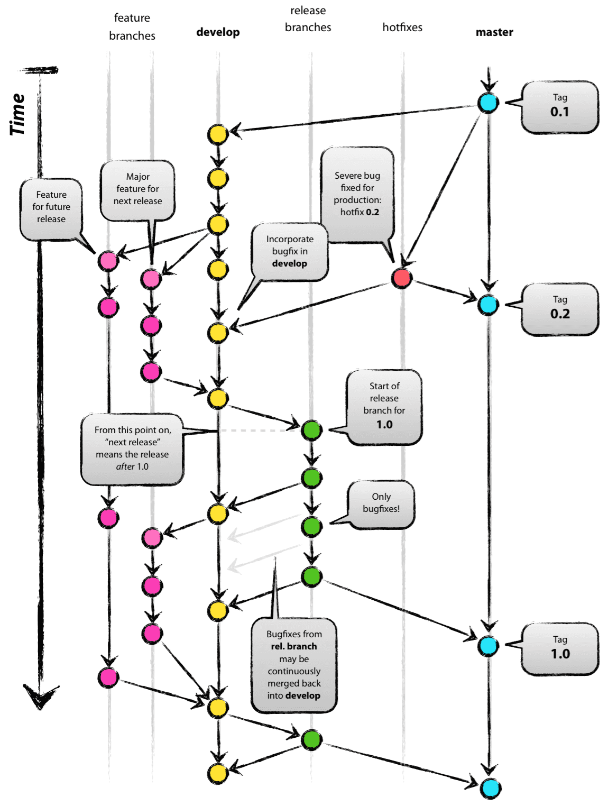

# GitHub Action, Git Flow

### Github Action?

* Github action은 github 저장소를 기반으로 소프트웨어 개발 workflow를 자동화 할 수 있는 도구, 쉽게 github에서 제공하는 ci / cd tool 임
* Workflow의 예시는 아래와 같음
  * test code 실행
  * 배포
  * 파이썬 버전 실행 여부 확인
  * 자동화 하고자 하는 스크립트
* Github repository 에 대한 모든 pull request를 빌드 및 테스트 하는 workflow를 생성하거나 병합된 pull request를 프로덕션에 배포할 수 있음
* 또한 단순한 DevOps를 넘어 repository에서 다른 이벤트가 발생할 때 workflow를 실행할 수 있도록 함
* Github는 workflow를 실행하기 위한 Linux, Windows 및 macOS에서 가상 머신을 제공하거나 자체 데이터 센터 또는 클라우드 인프라에서 자체 호스팅 runner를 호스팅 할 수 있음

### Component

* Pull request 또는 이슈가 발생하는 이벤트가 repository에서 발생할 때를 trigger로 인식하도록 github workflow를 구성할 수 있음. workflow에는 순차적 또는 병렬로 실행할 수 있는 하나 이상의 job이 포함되어 있음. 각 job은 자체 가상 머신 runer 내부 또는 컨테이너 내부에서 실행되며, 사용자가 정의한 스크립트를 실행하거나 job을 실행하는 하나 이상의 단계 (workflow를 단순화 할 수 있는 재사용 가능한 확장)이 있음


### Workflows

* Workflow는 하나 이상의 job으로 구성되고 event에 의해 trigger될 수 있는 자동화된 프로세스임
* 가장 최상위 개념으로 yaml로 작성되고 repository의 .github/workflows 폴더 아래에 저장함
* repository에는 여러 workflow를 가질 수 있으며 각 workflow는 서로 다른 작업을 수행할 수 있음

### Events

* Event는 workflow 실행을 trigger하는 특정 활동이나 규칙임
* pull rquest 생성 또는 issue를 열거나, 특정 브랜치로 push 하거나 특정 시간대에 cron하거나 webhook을 사용해 외부 이벤트를 통해 실행될 수 있음

### Jobs

* job은 여러 step으로 구성되고 가상 환경의 instance에서 실행됨
* 다른 job에 의존 관계를 가질 수 있으며 독립적으로 병렬 실행 가능함
* Workflow는 다양한 Job으로 구성되는데 기본적으로 병렬로 실행함

### Steps

* Workflow의 가장 작은 블럭으로 job을 만들기 위해 step들을 연결할 수 있음
* 재사용 가능한 Component로써 반복적인 코드의 양을 줄일 수 있고 git repository를 가져오거나 클라우드 공급자에게 인증을 설정할 수 있음
* 개인적으로 만든 action을 작성할 수도 있고 github marketplace에 있는 공용 action을 사용할 수 있음

### Runners

* Runner는 workflow가 trigger될 때 실행하는 서버
* 각 runner는 한번에 하나의 job을 실행할 수 있음
* Github에서 hosting 해주는 github-hosted runner와 직접 호스팅 하는 self-hosted runner로 나뉨
* Github-hosted runner는 azure의 standard-ds2-v2로 vCPU 2, 메모리 7GB, 임시 stoarge 14GB임

### Workflow 파일 내 컴포넌트 분

* master branch에 push 또는 pull request가 올 경우 실행되는 CI 이름을 가진 workflow 파일

```yaml
name: CI

    on:
        push:
            branches: [ master ]
        pull_request:
            branches: [ master ]
    jobs:
        build:
            runs-on: ubuntu-latest
            
        steps:
        - uses: actions/checkout@v2
        
        - name: Run a one-line script
          run: echo Hello, world!
          
        - name: Run a multi-line script
            run: |
                echo Add other actions to build.
                echo test, and deploy your project.
```

* name: CI란 이름으로 Github repository의 작업 탭에 표시될 workflow의 이름으로 작성 하지 않아도 무방함
* on: workflow에 대한 trigger를 지정함. 위의 예시에서 누군가가 master branch에 push하거나 pull request를 할 경우 workflow 실행이 trigger됨.\
  이는 array로 여러 branch를 설정할 수 있고 branch가 아닌 특정 파일 또는 스케줄도 설정할 수 있음
* jobs: CI workflow에서 실행되는 모든 job들을 그룹화 함
* build: build라는 이름의 job을 생성함. 그 하위에 2개의 step이 존재하는 구조임
* steps: build 작업에서 실행되는 모든 steps를 그룹화 함. 아래의 각 항목은 별도의 작업이거나 shell script임
  * uses: uses단계에서 actions/checkout@v2를 실행하도록 지정함\
    이는 repository를 runner에서 checkout하여 script 또는 build 및 test 도구를 실행할 수 있도록 하는 작업임\
    repository의 코드에 대해 workflow가 실행될 때 마다 checkout 작업을 사용해야 함
  * name: 해당 step의 이름 명시함
  * run: runner에서 command를 실행하도록 지시함. 환경 변수 설정 가능함


### Workflow 관리

#### 민감 정보 저장 및 사용

* github > settings > secrets에 저장하여 환경 변수로 사용 할 수 있음


```yaml
jobs: 
    example-job:
        runs-on: ubuntu-latest
        steps:
            - name: test secret key
              env:
                  secret_key: ${{ secrets.SUPERSECRET }}
              run: |
                  ~~~ "$secret_key"
```

#### job 간 의존 관계 설정

```yaml
jobs:
    job1:
    job2:
        needs: job1
    job3:
        needs: [job1, job2]
```

* job1은 job2가 시작되기 전에 완료되어야 하고 job3는 job1 및 job2가 완료될 때 까지 기다림

```yaml
jobs:
    setup:
        runs-on: ubuntu-latest
        steps:
            - run: ./setup.sh
     build:
         needs: setup
         runs-on: ubuntu-latest
         steps:
             - run: ./build.sh
     test:
         needs: build
         runs-on: ubuntu-latest
         steps:
             - run: ./test.sh
```

* setup 실행, 성공 후 build.hs가 실행하고 build가 성공하면 test.sh 실행함

#### 여러 버전으로 실행

* 다양한 OS, 플랫폼, 언어의 여러 조합에서 test를 하려는 경우 build matrix를 활용함
* Build option을 배열로 받는 strategy keyword를 사용하면 됨

```yaml
jobs:
    node-build:
        runs-on: ubuntu-latest
        strategy:
          matrix:
              # 다양한 버전의 Node.js를 이용하여 작업 여러번 실행
          node: [6, 8, 10]
        steps:
            - uses: actions/setup-node@v1
              with:
                  node-version: ${{ matrix.node }}
```

#### Cache 사용

* Github의 runner는 각 작업에서 새로운 환경으로 실행 되므로 작업들이 재사용 하는 경우 파일들을 caching하여 성능을 높일 수 있음
* Cache를 생성하면 해당 repository의 모든 workflow에서 사용 가능함

```yaml
jobs:
    example-job:
        steps:
            - name: Cache node modules
              uses: actions/cache@v2
              env:
                cache-name: cache-node-modules
              with:
                # `~/.npm` 디렉토리를 캐시해 성능을 높임
                path: ~./npm
                key: ${{ runner.os }}-build-${{ env.cache-name }}-${{ hashFiles('**/package-lock.json') }}
                restore-keys: |
                  ${{ runner.os}}-build-${{ env.cache-name }}-
```

#### Artifact 저장

* Artifact를 사용하면 job끼리 데이터를 공유하거나 workflow가 끝나고 데이터를 공유 가능함
* Workflow에서 생성된 파일을 upload하고, 다른 job에서 사용할 경우 upload된 파일을 download해서 사용하는 방식임

```yaml
name: Share data between jobs

    on: [push]
    
    jobs:
        job_1:
            name: Add 3 and 7
            runs-on: ubuntu-latest
            steps:
                - shell: bash
                  run: |
                      expr 3 + 7 > math-homework.txt
                - name: Upload math result for job 1
                  uses: actions/upload-artifact@v1
                  with:
                      name: homework
                      path: math-homework.txt
          job_2:
              name: Multiply by 9
              needs: job_1
              runs_on: windows-latest
              steps:
                  - name: Download math result for job 1
                    needs: job_1
                    runs-on: windows-latest
                    steps:
                        - name: Download math result for job 1
                          uses: actions/download-artifact@v1
                          with:
                              name: homework
                        - shell: bash
                          run: |
                              value=`cat homework/math-homework.txt`
                              expr $value $value \*9 > homework/math-homework.txt
                        - name: Upload math result for job 2
                          uses: actions/upload-artifact@v1
                          with:
                              name: homework
                              path: homework/math-homework.txt
          job_3:
              name: Display results
              needs: job_2
              runs-on: macOS-latest
              steps:
                  - name: Download math result for job 2
                    uses: actions/download-artifact@v1
                    with:
                        name: homework
                  - name: Print the final result
                    shell: bash
                    run: |
                        value=`cat homework/math-homework.txt`
                        echo The result is $value
```

### Git Flow?

* Git flow는 git으로 형상관리를 할 때 branch를 효율적으로 관리하기 위해 사용하는 branch management strategy임

### Git Flow 사용하는 이유?

* 형상관리를 효율적으로 하기 위해 Git Flow를 사용함. 대규모 프로젝트, 다수가 참여하는 프로젝트에서 더욱 효율적으로 진행하기 위함임

### About Git Flow

* Git barnch의 종류는 다섯가지가 있음
  * master: 제품으로 출시될 수 있는 branch
  * develop: 다음 출시 버전을 개발하는 branch
  * feature: 기능을 개발하는 branch
  * release: 이번 출시 버전을 준비하는 branch
  * hotfix: 출시 버전에서 발생한 버그를 수정하는 branch
* Gitflow를 검색해보면 아래의 그림을 쉽게 찾을 수 있음




#### 참고






