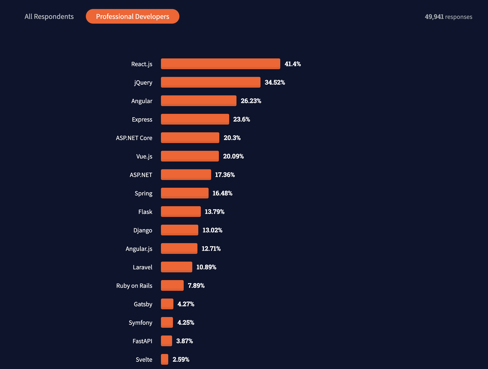

# React ? Vue?

* Front-end 개발에 있어 가장 많이 사용되어지고 있는 것이 React, Vue 등이 있. React가 가장 인기가 높고 Vue는 순위는 낮으나 사용자가 점점 증가하고 있는 추세임.
* 본 페이지에서는 현업에서 가장 많이 사용되고 있는 React와 Vue를 비교하고자 함.
* React와 Vue의 대표적인 차이는 React는 라이브러리(library)이고 Vue는 프레임워크(framework)라는 것임.
* 라이브러리는 참고가 용이하고, 라이브러리의 일부만 가져와서 사용하는 것이 편리함. React는 UI 라이브러리이므로 자체만으로 전역 상태 관리, 라우팅, 빌드 시스템 등을 지원하지 않고 Redux, Recoil, React-router-dom 등을 사용해야 함.
* 프레임워크는 부분적인 사용이 불가하고 프레임워크 자체를 사용하면서 프레임워크가 지원해주는 문법에 따라 작성해야 함. 라이브러리와는 다르게 더 많은 기능을 default로 제공함.
* 이러한 차이점으로 인해 React는 js 문법을 응용하여 개발 가능하고, Vue는 프레임워크에 지정된 문법으로 개발 가능함.

### 차이점

* React는 JSX (Javascript XML) 형태로 코드를 작성하여 js 문법을 응용하기 때문에 js 만으로 UI 로직과 DOM을 구현함
* Vue는 html, js, css를 분리하여 작성함.

### 컴포넌트 분리와 재사용

* React의 가장 큰 장점중 하나는 컴포넌트의 생성 및 재사용. 파일별로 컴포넌트를 분리할 수 있으며, 새로운 함수형 컴포넌트를 생산하고, props 형태로 전달하거나 재사용이 용이함
* Vue는 새로운 컴포넌트를 만들어 분리하기 위해 새로운 파일을 하나 더 만들고, html, script, css를 모두 작성해 주어야 함. 또한 props를 전달하는 과정에서도 해당 컴포넌트를 사용하는 모든 파일을 오가며 작성해주어야 함

### 진입 장벽

* React는 자유도가 높으나 진입 장벽이 Vue 보다 더 높음
* Vue는 정해진 틀 안에서 개발을 해야 하지만 기존 html 파일에 사용하는 형식과 매우 유사하게 구조를 가져가므로 진입 장벽이 낮음.

### 장단점

* Vue가 React에 비해 속도는 조금 더 빠름
* 러닝커브 또한 Vue가 React 보다 낮음
* 하지만 Typescript 등을 지원 하는 면에 있어 React가 호환이 좋으며 대규모 서비스 개발에 용이함
* React는 사용량에 따른 커뮤니티의 규모가 크고 활성화 되어 있어 이슈 해결에 더 좋음.
