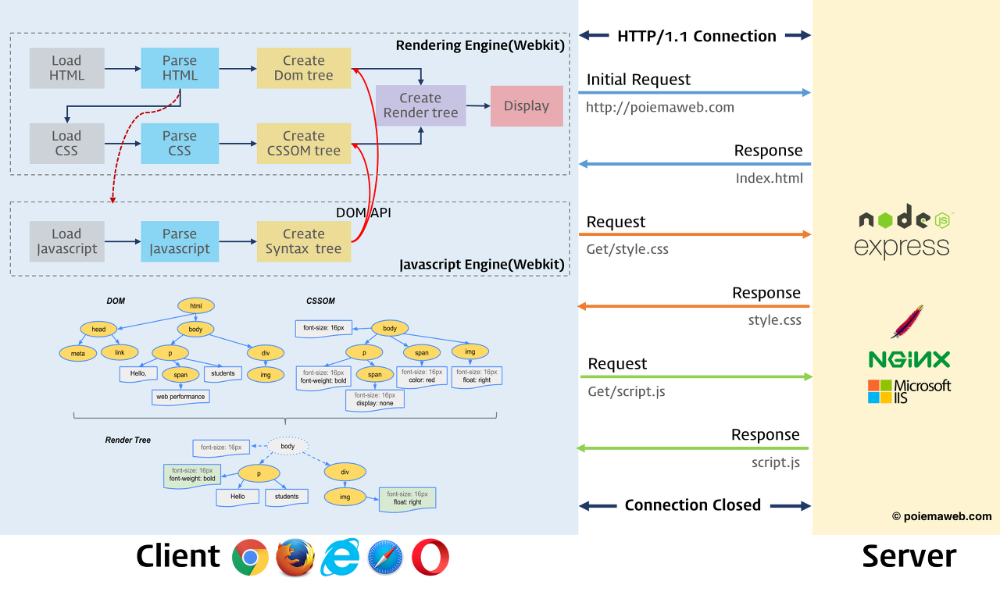

# 브라우저 동작 방식

### 브라우저?

* 웹 브라우저는 동기적으로 (HTML + CSS), JS 언어를 해석하여 내용을 화면에 보여주는 응용 소프트웨어

### 브라우저 구조

* 사용자 인터페이스
  * 사용자가 접근할 수 있는 영역
  * URI를 입력할 수 있는 주소 표시줄, 이전 / 다음 버튼, 북마크 메뉴, 새로 고침 버튼과 현재 문서의 로드를 정지하는 정지 버튼, 홈 버튼 등 요청한 페이지를 보여주는 창을 제외한 나머지 모든 부분
* 브라우저 엔진
  * 사용자 인터페이스와 렌더링 엔진 사이 동작을 제어
  * Data storage를 참조하며 로컬에 데이터를 쓰고 읽으며 다양한 작업을 함
* 렌더링 엔진
  * 웹 서버로부터 응답 받은 자원을 웹 브라우저 상에 나타냄
  * 브라우저는 서버로부터 HTML 문서를 응답 받으면 렌더링 엔진의 HTML Parser와 CSS Parser에 의해 parsing 되어 DOM, SSOM 트리로 변환되고 render tree로 결합 함.
  * 이렇게 생성된 render tree를 기반으로 브라우저는 웹 페이지를 나타냄
* 통신
  * HTTP 요청과 같은 서버와 통신이 가능하게 하는 네트워크 호출에 사용됨
* UI 벡엔드
  * select, input 등 기본적인 위젯을 그리는 인터페이스임
* js 해석기
  * js 코드를 해석하고 실행 함
* 자료 저장소
  * Cookie, Local Storage, Indexed DB 등 브라우저 메모리를 활용하여 저장하는 영역임

### 렌더링 엔진

* 렌더링 엔진은 HTML, XML, 이미지 등 요청 받은 내용을 브라우저 화면에 표시하는 엔진임
* 렌더링 엔진의 종류는 다음과 같음
  * 크롬,오페라: Blink
  * 사파리: Webkit
  * 익스플로러: Trident
  * 마이크로소프트 엣지: EdgedHTML
* 렌더링 엔진은 일련의 과정들이 동기적으로 진행되지 않음
* HTML을 parsing 할 때 까지 기다리지 않고 render tree 배치와 그리기 과정을 시작함

### 렌더링 엔진 동작 과정

* 렌더링 엔진은 서버로부터 응답받은 HTML 문서를 얻는 것으로 시작함
* 이 문서의 내용은 보통 8KB 단위로 전송 됨

* 렌더링 엔진은 다음과 같은 단계로 동작함
  * HTML 문서를 parsing 하여 DOM tree 구축
  * CSS 파일과 함께 포함된 style 요소 parsing(CSSOM)
  * DOM tree와 위 단계의 결과를 합쳐 render tree 구축
  * render tree 각 노드에 대해 화면 layout 결정
  * UI 백엔드에서 render tree의 각 노드를 그림

### Javascript?

* JS는 JS 엔진이 처리함
* HTML parser가 \<script> tag를 만나면 js 코드를 실행하기 위해 DOM 생성 프로세스를 중지하고 JS 엔진으로 권한 넘김
* 권한 받은 JS 엔진은 \<script> tag 내의 js 코드 또는 src 속성에 정의된 js 파일을 로드하고 parsing 하여 실행 함
* js의 실행이 완료되면 다시 HTML parser로 제어 권한을 넘겨 중지했던 시점으로 돌아가 DOM 생성 재개함

* 참고 : [https://bbangson.tistory.com/87](https://bbangson.tistory.com/87)

