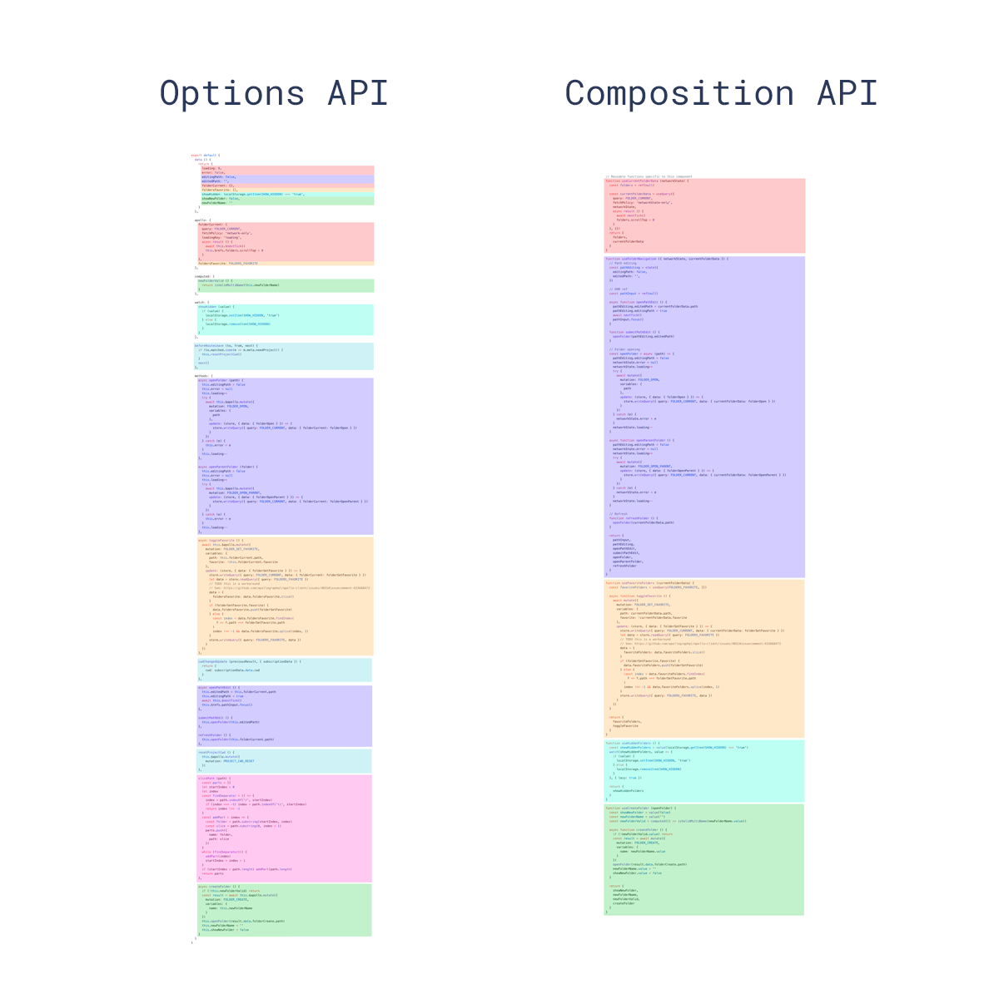

# Vue2 vs Vue3

### 요약

* Composition API라는게 들어오면서 데이터 선언, 함수 선언, 상태 관리 등에서 변화가 생김
* 컴포넌트 내에서 데이터, 함수, 상태를 호출하는 방식도 변함
* 없던 종류의 컴포넌트가 몇몇 생길 예정임 (문법은 미확정 상태임)
* 내부적으로 성능 향상을 위한 변화도 진행 예정임

### 1. 템플릿 생성 방식의 변화

* Vue2의 경우 하나의 루트 엘리먼트만 허용하였으나 Vue3 부터는 여러 개의 루트 엘리먼트를 가질 수 있음
* Vue2의 경우 props나 method 등을 구분 없이 이름만으로 호출 할 수 있도록 동작하였는데, Vue3에서는 문맥상 분리 할 수 있게됨

```html
<template>
    <div>
        <div class="input-label">
            <!--{{inputLabel}}--> // Vue2
            {{state.inputLabel}} // Vue3
        </div>
        <input type="text" />
    </div>
</template>
```

### data, method 작성 방식의 변화

* Vue2에서의 data, method 등의 선언이 Vue3에서 setup이라는 method 안으로 편입됨.

```javascript
// Vue2.x
export default {
    props: {
        title: String
    },
    data() {
        return {
            username: '',
            password: ''
            }
        },
    methods: {
        login() {
            // login method
        }
    }
}
```

```javascript
// Vue3.x
export default {
    props: {
        title: String
    },
    setup() {
        const state = reactive({
            username: '',
            password: ''
        })
        
        const login = () => {
            // login method
        }
        return {
            login,
            state
        }
    }
}
```

* state의 경우에도 그냥 선언하는 것이 아닌 vue reactive를 사용하게 되어 있음
* reactive (반응형)은 Vue가 반응형 시스템을 유지하기 위해서 사용하는 간단한 js 객체임.&#x20;


* Vue2 에서는 data나 method, computed 등을 선언하게 되면 알아서 각각에 대해 위와 같이 동작하는 reactive 객체를 생성함. 하지만 그 과정이 묵시적이었고, 유저들은 위 과정을 알 필요가 없었음. 하지만 Vue3에서의 Typescript의 지원이나 state로의 명칭 변경, 명시적 reactive 사용 등을 보았을 때, 전반석으로 명료한 선언을 지향하는 방향으로 변화한 것으로 보임

### Lifecycle hook 호출의 변화

* Vue2의 lifecycle hook의 경우에 data, method와 같은 hierachy에서 선언하도록 되어 있음.&#x20;
* Vue3에서는 다른 변화들과 같이 lifecycle hook 또한 setup 내부에서 선언하도록 함. 기존에 존재하던 lifecycle hook의 종류는 거의 그대로 유지됨

```javascript
import { onBeforeMount, onMounted, onBeforeUpdate, onUpdated, onBeforeUnmount, oUnmounted, onActivated, onDeactivated, onErrorCaptured } from 'vue'

export default {
    setup() {
        onBeforeMount(() => {
        // ...
        })
        onMounted(() => {
        // ...
        })
        onBeforeUpdate(() => {
        // ...
        })
        onUpdated(() => {
        // ...
        })
        onBeforeUnmount(() => {
        // ...
        })
        onUnmounted(() => {
        // ...
        })
        onActivated(() => {
        // ...
        })
        onDeactivated(() => {
        // ...
        })
        onErrorCaptured(() => {
        // ...
        })
    }
```

* 이 때 const 등으로 선언했던 state나 method들과는 달리 lifecyle hook은 return 할 필요가 없음
* 각각의 함수는 실행되는 것이지 반환되는 값이나 함수 자체를 변수에 할당하는 것이 아니므로 따로 return 하여 setup의 return으로써 포함시킬 필요가 없음

### Computed 속성 사용의 변

* computed 속성은 별도 옵션이 아닌 state 선언문 내에 computed 속성에 대한 선언 구문을 추가하는 방식으로 변경됨

```javascript
// Vue2.x
export default {
    //...
    computed: {
        lowerCaseUsername () {
            return this.username.toLowerCase()
        }
    }
}
```

```javascript
// Vue3.x
import {reactive, computed} from 'vue'

export default {
    props: {
        title: String
    },
    setup () {
        const state = reactive({
            username: '',
            password: '',
            lowerCaseUsername: computed(() => state.username.toLowerCase())
        })
        
        // ...
    }
}
```

* 이러한 변화는 사용하는 것만 import하여 사용하도록 하는 의도가 있음
* 기존의 컴포넌트 중 computed가 필요한 컴포넌트는 상당히 소수임에도 불구하고 모든 컴포넌트는 옵션으로써 computed를 작성하는 순간 별도의 import 없이 동작함
* Vue3에서는 이러한 변화를 수정하고자 하여 computed나 lifecycle hook 등 다양한 옵션들을 함수 형태로 동작하도록 변경함

### Composition API

* 구성 API 정도가 되는 이 API는 컴포넌트를 선언하고 조립하기 위한 새로운 API임. 완전히 종료된 논의가 아닌, 어느 정도 이야깃거리가 남아있는 이슈지만 전반적으로 논리적이고 가독성이 좋은 코드를 작성하기 위해 새로운 방식의 API를 도입하는 것에 동의하는 분위기임
* Composition API가 등장하게 된 배경은 기존에는 볼륨이 큰 컴포넌트가 생겼을 때 상태 변수(data에 선언된 변수들 등)의 선언, 이 변수들의 computed 메소드 바인딩, methods 함수 선언, lifecycle hook 선언 등이 혼재되어 논리에서 어긋난 구조를 생성하고 있었음



* 기존의 Vue는 data, computed, methods를 사용할 수 있는 Options API를 사용하고 있었
* Options API는 직관적이지만 컴포넌트의 크기가 커졌을 때 유지보수가 굉장히 어려워 진다는 문제를 야기함. 하나의 feature에 대한 코드가 여기저기로 흩어짐. Composition API는 이러한 유지보수 측면에서의 문제를 해결하기 위한 해법으로 생각할 수 있음

### props와 this 바인딩의 분리

* 기존 props 뿐 아니라 method, data 등을 전부 this에 바인딩함으로써 코드의 가독성이 떨어지는 것을 개선하기 위해 변경됨

```javascript
// Vue2.x
mounted() {
    console.log('title:' + this.title)
}
```

```javascript
// Vue3.x
setup(props) {
    // ...
    onMounted(() => {
        console.log('title:' + props.title)
    })
    // ...
}
```

### emit과 this 바인딩의 분리

* emit도 props 와 마찬가지로 this에 더이상 바인딩 되지 않고 setup 함수의 attribute로써 호출 할 수 있음

```javascript
// Vue2.x
login() {
    this.$emit('login', {
        username: this.username.
        password: this.password
    })
}
```

```javascript
// Vue3.x
setup(props, {emit}) {
    // ...
    
    const login = () => {
        emit('login', {
            username: state.username,
            password: state.password
        })
    }
    
    // ...
}
```

### Suspended Component

### Fragment

* Vue3에서는 루트 엘리먼트가 여러개인 컴포넌트를 지원함
* 기존에는 table안에 들어가는 td 두 개를 하나의 컴포넌트로 묶어 사용 하는 것 등이 불가능 했는데 \<Fragment>로 감싸면 사용 가능

### Portal

* 리액트에서 사용하는 Portal 컴포넌트도 지원할 예정임. Portal 컴포넌트는 내부 컨텐츠를 포탈 타겟 컴포넌트로 옮기는 컴포넌트임. 다만 아직 Vue에서의 정확한 문법은 결정되거나 공개되지 않았으며, 아래와 같이 동작할 것으로 예상하고 있음

```html
<template>
    <div>
        <div>
            <p>
                The content below this paragraph is
                rendered in the right/bottom (red) container by PortalVue
            </p>
            
            <!-- [중요] 아직 결정된게 아님! -->
            
            <Portal to="right-basic">
                <p class="red">
                    This is content from the left/top container (green).
                    The cool part is, it works acrross components,
                    so you can send your content anywhere!
                </p>
            </Portal>
        </div>
        <PortalTarget name="right-basic"></PortalTarget>
    </div>
</template>
```

### 기타 내부적인 변화

* 내부적으로도 구조에 변화가 있음. 여러 변화가 예상되지만 주요한 변화로 두 가지 정도를 꼽아 볼 수 있음
  * 렌더링 트리 최적화
    * 기존 V-DOM의 설계는 Vue 옵저버 기반 프록시를 유지하기 위해 상당히 많은 자원을 소모하고 있었음. 모든 Dependency를 V-DOM tree에서 recursive하게 탐색했기 때문인데, v-if와 v-for directive의 모든 dependency tracking을 위해서 필요했던 기능이지만 대부분의 구문들이 static data를 다룬다는 점에서 불필요한 자원 소모라고 판단한 것으로 예측됨
    * 이를 해결하기 위해서 Vue는 dynamic / static component를 구분하기로 함

### 개인적인 느낌

* Vue3로 버전이 upgrade 됨에 따라 가독성, 구조적 효율성 등을 많이 고려한 것으로 보임
* 다 ui library인 리액트의 일부 표현법 또한 차용 함으로써 리액트에 비해 늦게 출시되었지만 장점들을 가져가는 방법을 취함
* 아직 Vue3 는 안정적이지 않다는 느낌이 듦. 좀 더 Vue2 를 이용한 개발을 진행하며 Vue3로의 단계별 진입이 필요해 보이며 추후에는 Vue3로 완전 migration이 필요해 보임.
