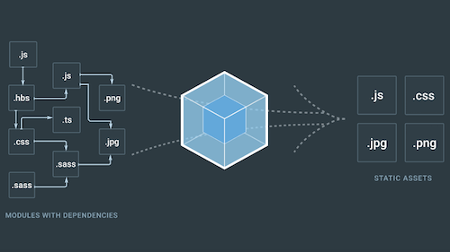

# Webpack & Babel

### Webpack?

* 모듈 번들링이라고 정의함
* html 파일에 들어가는 js 파일들을 하나의 js 파일로 만들어주는 방식을 모듈 번들링이라고 함
* Webpack은 필요한 다수의 js 파일을 하나의 js 파일로 만들어 주는 것을 말



### Webpack을 사용해야 하는 이유

* 이전 html 개발 방식은 페이지마다 새로운 html을 요청하는 방식이었는데, 최근에는 SPA (Single Page Application) 방식으로 하나의 html 페이지에 여러 개의 js 파일들이 포함된다. 연관되어있는 js 파일들의 종속성 등을 관리하기 편함.
* 파일을 컴파일 할 때 여러 모듈들을 읽어오려면 시간이 오래 걸리게 되는데 하나의 파일로 번들링 하면 시간이 오래 걸리는 문제가 해소됨.
* 하나의 js 파일로 만들기에 웹페이지의 성능 최적화가 됨.

### Webpack 사용법

* Webpack을 설치하기 전 js config 파일을 만들어야  함
* Webpack을 설치할 최상위 폴더에 webpack.config.js 파일을 만

```javascript
const path = require('path'); // 파일의 경로를 다루고 변경하는 유틸리

module.exports = {
    entry : './src/test,js' // build 대상, 진입
    output : {
        filename: 'bundle.js',
        path: path.resolve(__dirname + '/build')
    }, // build 결과를 저장할 경
    mode: 'none'
}

// Plug-in: build된 번들 파일을 동적으로 특정 html 페이지에 추가 할 수 있으
// build시에 js, css, html 등의 파일을 난독화 및 압축 진행 가
```

* 이후 아래 와 같은 명령어를 통해 설치 진

```javascript
npm init -y
npm install webpack --save-dev

// 만약 webpack v4 혹은 그 이후 버전을 사용한다면 cli도 설치해야 함

npm install --save-dev webpack-cli

// webpack 설치 후 아래 명령어를 통해 설치 여부 확인

.\nodemodules\.bin\webpack -v
```

* js 파일 중에는 css / img / jsx 등 여러가지가 있는데 이 파일들을 하나의 webpack으로 번들화 하기 위해서는 그 파일들을 설정해 주어야 함
* 그 과정에서 Loader를 사용해야 함
* style-loader와 css-loader는 같이 사용되며 모든 설치는 npm을 통해 설치가 진행됨

```javascript
npm install style-loader css-loader --save-dev
```

* 설치 후 webpack.config.js 파일 수정

```javascript
var path = require('path');

moudle.exports = {
    entry: './src/test.js',
    output: {
        filename: 'bundle.js',
        path: path.resolve(__dirname + '/build')
    },
    mode: 'none',
    module: {
        rules: [
            {
                test: /\.css$/,
                use: [
                    'style-loader',
                    'css-loader'
                ]
            }
        ]
    }
};
```

### Babel?

* Babel은 최신 ES6버전을 구 버전인 ES5로 변환 해줌

### Babel을 사용해야 하는 이유

* 최신 업데이트 중 ES6 버전은 큰 부분을 차지함. 크롬, 사파리 등과 같은 에버그린 브라우저는 최신 업데이트 버전으로 지원함\
  하지만 IE11은 ES6를 지원하지 않으므로 ES5로 변경해주어야 함
* 따라서 개발 환경을 설정할 때 webpack 및 babel로 기초 환경을 설정해야&#x20;

### Babel 사용 법

* 아래 명령어로 babel 설치 진행

```javascript
npm install @babel/node
npm install @babel/preset-env
npm install @babel/core
```

* 이후 최상위 폴더에 .babelrc 파일을 만들고 아래 소스를 입력함

```javascript
{
    "presets" : ["@babel/preset-env"]
}
```

* package.json의 scrip 부분에서 start 도 babel-node index.js로 수정하고 npm run start를 입력하면 babel 커맨드가 실행됨
