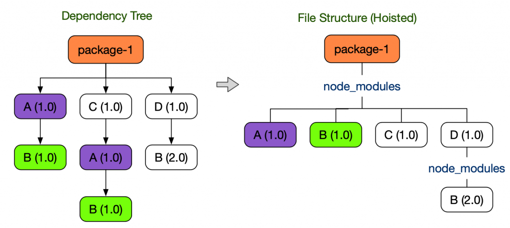

# Yarn berry, Recoil

### Yarn berry?

* Node.js를 위한 새로운 패키지 관리 시스템으로 기존의 npm의 문제점을 개선함

### NPM의 문제점

#### 비효율적인 의존성 검색

* npm은 파일 시스템을 이용하여 의존성을 관리하는데, 이때 node\_modules 폴더를 이용함
* 이때 의존성 검색은 비효율적으로 동작함

#### 환경에 따라 달라지는 동작

* npm은 패키지를 찾지 못하면 상위 디렉토리의 node\_modules 폴더를 계속 검색함
* 이 특성 때문에 어떤 의존성을 찾을 수 있는지는 해당 패키지의 상위 디렉토리 환경에 따라 달라짐

#### 비효율적인 설치

* node\_modules 디렉토리 구조는 매우 큰 공간을 차지함
* 일반적으로 간단한 cli 프로젝트에도 수백 MB의 node\_modules 폴더가 필요함
* 용량만 많이 차지할 뿐만 아니라 큰 node\_modules 디렉토리 구조를 만들기 위해서는 많은 I/O 작업이 필요함

#### 유령 의존성 (Phantom Dependency)

* npm 및 yarn v1에서는 중복해서 설치되는 node\_modules를 아끼기 위해 hoisting 기법을 사용

* 이때 hoisting에 따라 직접 의존하고 있지 않은 library를 require() 할 수 있는 현상을 유령 의존성이라고 함

### Yarn berry는 위에서 언급한 문제를 Plug'n'Play (PnP) 전략을 이용하여 해결함

### Yarn berry의 장점

* .pnp.cjs 파일이 제공하는 자료구조를 이용하여 바로 의존성 위치를 찾기 때문에 의존성을 검색할 때 더 이상 node\_modules를 순회할 필요가 없음
* 패키지의 모든 의존성은 .pnp.cjs 파일을 이용하여 관리되기 때문에 더 이상 외부 환경에 영향 받지 않음
* 더 이상 설치를 위해 깊은 node\_modules 디렉토리를 생성하지 않아도 되며 zero-install을 사용하면 대부분 library를 설치 없이 사용할 수 있음
* Yarn berry에서 의존성을 버전 관리에 포함 하는 것을 zero-install 이라고  함
* Yarn PnP는 node\_modules에서와 같이 의존성을 끌어올리지 않음. 이로써 각 패키지들은 자신이 package.json에 기술하는 의존성에만 접근 가능함\
  이로써 유령 의존성 현상을 근본적으로 막을 수 있음
* Yarn PnP에서는 zip 파일을 이용하여 패키지를 관리하기 때문에 빠진 의존성을 찾거나 의존성 파일이 변경되었음을 찾기 쉬움

### Recoil?

* React 프로젝트를 위한 전역 상태관리 library들중 하나로 2020년 5월 facebook에서 출시함
* 최근에 출시되었기에 Redux, Mobx와 같은 다른 libaray와는 달리 React 전용이며 React에 최적화되어 있다고 할 수 있

### 기존 Redux의 문제점

* React전용 library가 아니므로 동시성 모드를 구현하기에 호환성이 부족함
* 복잡한 Boilter Plate 초기 세팅이 요구되어 비효율적이며 러닝커브가 높음
* 비동기 데이터에 추가 리소스가 요구되어 Redux-sage 등 서드파티 라이브러리가 요구됨

### Recoil 특징

* React 전용 library인 만큼 React 내부 접근성이 용이하며 특히 React 동시성 모드, suspense 등을 지원하기 때문에 사용자 경험 관점에서도 매우 유리한 웹 어플리케이션을 만들 수 있음
* 전역 상태의 설정/정의가 매우 쉬우며 Recoil이 지원하는 Hooks로 이를 get/set 하기 때문에 React 문법과 매우 유사함
* Recoil 공식 문서에서 출시한 동기에 대해 아래와 같이 정리함
  * Shared state도 local state처럼 간단한 get/set 인터페이스로 사용할 수 있는 Boilerplate-free api를 제공하고자 함
  * 동시성 모드를 비롯한 다른 새로운 react의 기능들과의 호환 가능성도 가짐
  * 상태 정의가 증분 및 분산되므로 코드 분할이 가능함
  * 상태를 사용하는 컴포넌트에서 수정 필요없이, 상태에서 파생된 데이터를 사용 가능함. 또한 파생된 데이터는 동기/비동기 모두 가능함
  * 탐색을 일급 개념으로 취급할 수 있고 링크에서 상태 전환을 인코딩 할 수 있음
  * 역 호환성 방식으로 전체 앱 상태를 유지하는 것을 쉬우므로, 유지된 상태는 애플리케이션 변경에도 살아남을 수 있음 (캐싱)

### 주요 개념

* Recoil을 사용하면 atoms (공유 상태)에서 selector (순수 함수)를 거쳐 React 컴포넌트로 내려가는 data-flow graph를 만들 수 있음
* Atoms는 컴포넌트가 구독할 수 있는 상태의 단위임. selector는 atoms 상태 값을 동기 또는 비동기 방식을 통해 변환함
* 또한 Recoil에서 지원하는 Hooks들로 atom 혹은 selector의 get (접근) 및 set (수정) 등의 다양한 동작이 가능함

### Atoms

* Atoms는 Recoil의 상태의 단위를 의미함. 컴포넌트간에 이 상태는 공유되며, 구독 및 업데이트가 가능함
* atom의 상태가 업데이트 되면 구독하던 컴포넌트들이 모두 리렌더링됨
  * Redux는 Reducer (통상 상위 도메인) 단위로 state를 구성하나, Recoil은 Atoms (상태) 단위로 좀 더 잘게 구성할 수 있음

### 전역 상태 관련 Hooks

* 전역 상태 (Atoms, Selector)를 get/set 하기 위해 Recoil에서 제공하는 Hooks들을 사용함. 기본적으로 아래 4가지가 크게 사용됨
  * useRecoilState(): useState()와 유사함. \[state, setState] 튜플에 할당하며, 인자에 Atoms(혹은 Selector)를 넣어줌
  * useRecoilValue(): 전역 상태의 state 상태값 만을 참조하기 위해 사용함. 선언된 변수에 할당하여 사용함
  * useSetRecoilState(): 전역 상태의 setter 함수만을 활용하기 위해 사용됨. 선언된 함수 변수에 할당하여 사용함
  * useResetRecoilState(): 전역 상태를 default(초기 값)으로 Reset 하기 위해 사용함. 선언된 함수 변수에 할당하여 사용

### Selector

* Selector는 atom 혹은 다른 selector 상태를 입력 받아 동적인 데이터를 반환하는 순수 함수 (Pure function)임
* 상태 값에서 비롯된 파생된 데이터를 만들 때 사용되며, atom 처럼 컴포넌트가 이를 구독 할 수 있음 (readonly 값이므로 useRecoilValue)
* Selector가 참조하던 다른 상태가 변경되면 이도 같이 업데이트 되며, 이때 selector를 바라보던 컴포넌트들이 리렌더링
